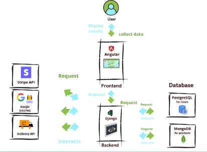
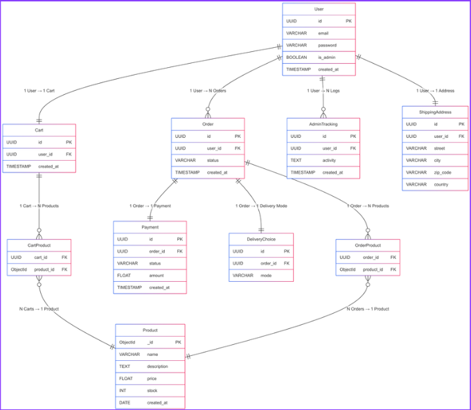

# 🌿 Nature & Animaux


<details>
<summary>🇫🇷 Lire en Français</summary>

## Présentation du projet

Nature & Animaux est un site e-commerce dédié aux produits naturels et animaliers.  
Le projet vise à remplacer l’ancien site basé sur Wix pour réduire les coûts et offrir plus de liberté technique.  

Les objectifs principaux :  
- Mise en place d’une boutique en ligne performante.  
- Gestion des utilisateurs et administrateurs.  
- Gestion des commandes, produits et stocks via une interface admin simple.  
- Authentification sécurisée (utilisateurs et admins).  
- Connexion Google OAuth2.  
- Optimisation des performances (lazy loading, responsive design).  

---

## Stack Technique

- **Frontend** : Angular (mode standalone, responsive mobile/tablette/desktop).  
- **Backend** : Django (API REST).  
- **Base de données relationnelle** : PostgreSQL (utilisateurs et administrateurs).  
- **Base de données NoSQL** : MongoDB (produits).  
- **Autres** : Cloudinary (upload d’images), Stripe (paiements en ligne), OAuth2 (Google login).  

---

## Architecture



---

## Base de données



- **PostgreSQL** : gestion des utilisateurs et des administrateurs.  
- **MongoDB** : stockage des produits et gestion flexible du catalogue.  

---

## Installation & Lancement

### 1. Cloner le projet
```
git clone https://github.com/TON_GITHUB/Nature-Animaux.git
cd Nature-Animaux
```
### 2. Lancer le backend (Django)
```
cd backend
python -m venv .venv
source .venv/bin/activate
pip install -r requirements.txt
python manage.py migrate
python manage.py runserver
```
### 3. Lancer le frontend (Angular)
```
cd frontend
npm install
ng serve
```
Le site sera accessible sur : http://localhost:4200

L’API sur : http://127.0.0.1:8000

## Fonctionnalités principales
Authentification sécurisée (JWT + OAuth2 Google).

Gestion des produits (CRUD).

Gestion des utilisateurs et administrateurs.

Panier et commandes.

Paiement en ligne (Stripe).

Upload d’images (Cloudinary).

Responsive design.

## Roadmap
 Mise en place de la base projet (Angular + Django).

 Authentification sécurisée.

 Gestion utilisateurs/admins.

 Connexion PostgreSQL & MongoDB.

 Lazy loading (optimisation perf).

 Intégration paiement Stripe.

 Gestion avancée des commandes & livraisons.

 Finalisation interface admin.

## Équipe
Erwan Lebreton – Développeur Fullstack (Frontend & Backend).

Yoann Gaubert – Responsable projet (Nature & Animaux).

</details>


<details>
<summary>🇬🇧 Read in English</summary>

##  Project Overview

Nature & Animaux is an e-commerce website dedicated to natural and animal-related products.  
The project aims to replace the former Wix-based site to reduce costs and provide greater technical freedom.  

Main objectives:  
- Build a high-performance online store.  
- Manage users and administrators.  
- Manage orders, products, and stock through a simple admin interface.  
- Secure authentication (users and admins).  
- Google OAuth2 login integration.  
- Performance optimization (lazy loading, responsive design).  

---

## Tech Stack

- **Frontend**: Angular (standalone mode, responsive for mobile/tablet/desktop).  
- **Backend**: Django (REST API).  
- **Relational Database**: PostgreSQL (users and administrators).  
- **NoSQL Database**: MongoDB (products).  
- **Others**: Cloudinary (image uploads), Stripe (online payments), OAuth2 (Google login).  

---

## Architecture


---

##  Database


- **PostgreSQL**: handles users and administrators.  
- **MongoDB**: manages products with flexible catalog storage.  

---

## Installation & Setup

### 1. Clone the project
```bash
git clone https://github.com/TON_GITHUB/Nature-Animaux.git
cd Nature-Animaux
```
### 2. Run the backend (Django)
```
cd backend
python -m venv .venv
source .venv/bin/activate
pip install -r requirements.txt
python manage.py migrate
python manage.py runserver
```
### 3. Run the frontend (Angular)
```
cd frontend
npm install
ng serve
```

The website will be available at: http://localhost:4200

The API at: http://127.0.0.1:8000

## Key Features

Secure authentication (JWT + Google OAuth2).

Product management (CRUD).

User and admin management.

Cart and orders.

Online payments (Stripe).

Image upload (Cloudinary).

Responsive design.

## Roadmap

 Project setup (Angular + Django).

 Secure authentication.

 User/admin management.

 PostgreSQL & MongoDB connection.

 Lazy loading (performance optimization).

 Stripe payment integration.

 Advanced order & delivery management.

 Admin interface finalization.

## Team

Erwan Lebreton – Fullstack Developer (Frontend & Backend).

Yoann Gaubert – Project Manager (Nature & Animaux).

</details>