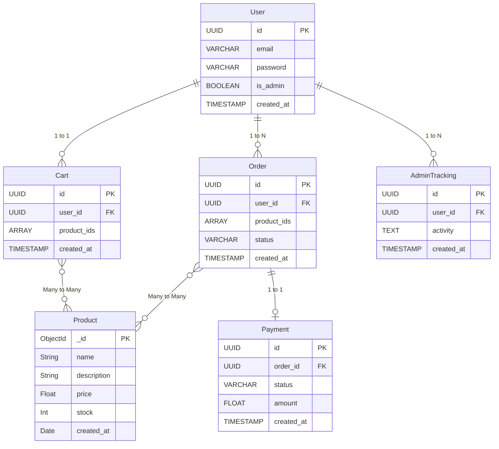

```mermaid
erDiagram
    User {
        UUID id PK
        VARCHAR email
        VARCHAR password
        BOOLEAN is_admin
        TIMESTAMP created_at
    }

    Order {
        UUID id PK
        UUID user_id FK
        ARRAY product_ids
        VARCHAR status
        TIMESTAMP created_at
    }

    Product {
        ObjectId _id PK
        String name
        String description
        Float price
        Int stock
        Date created_at
    }

    Cart {
        UUID id PK
        UUID user_id FK
        ARRAY product_ids
        TIMESTAMP created_at
    }

    Payment {
        UUID id PK
        UUID order_id FK
        VARCHAR status
        FLOAT amount
        TIMESTAMP created_at
    }

    AdminTracking {
        UUID id PK
        UUID user_id FK
        TEXT activity
        TIMESTAMP created_at
    }

    User ||--o{ Order: "1 to N"
    User ||--o{ Cart: "1 to 1"
    User ||--o{ AdminTracking: "1 to N"
    Cart }o--o{ Product: "Many to Many"
    Order }o--o{ Product: "Many to Many"
    Order ||--o| Payment: "1 to 1"

```
